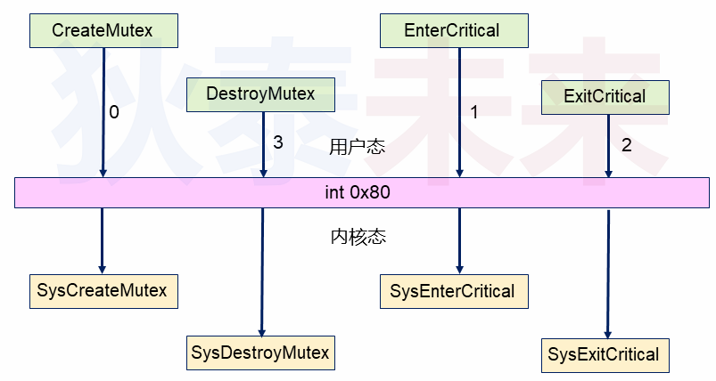
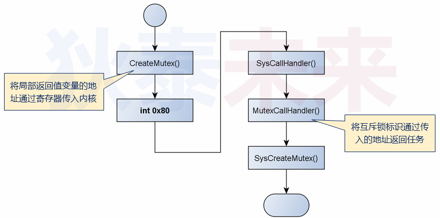
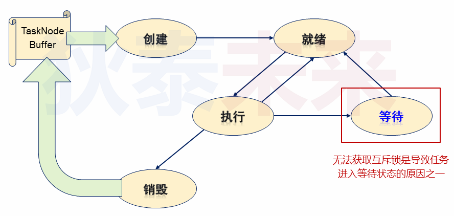
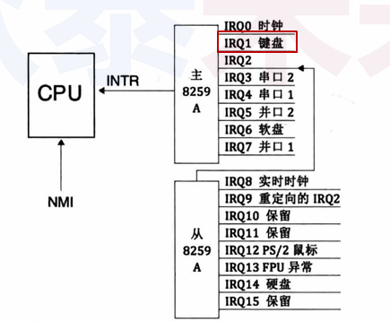
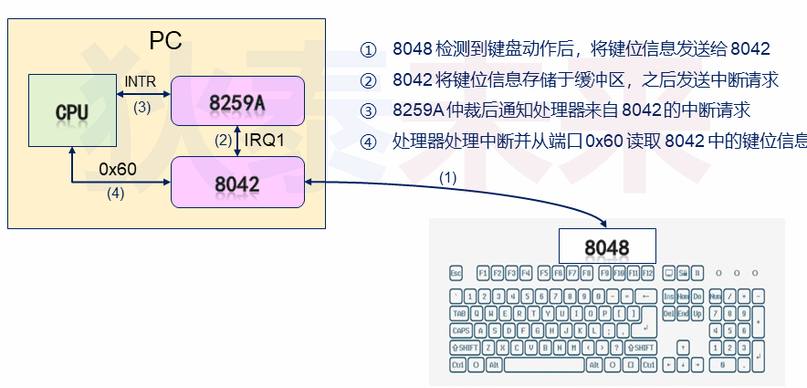

# 操作系统课程笔记

## 第1课 进阶操作系统
### 什么是操作系统？
    Windows Unix Linux MacOS iOS
    操作系统是直接运行于硬件之上的计算机程序
    操作系统是用于管理和控制计算机的硬件与软件资源
    操作系统为用户软件的开发提供必要的服务和接口
    
### BIOS - Base Input & Output System
    BIOS是计算机上电后第一个运行的程序
    BIOS首先检测硬件状态, 检测通过后立即进行硬件初始化
    BIOS会在内存中建立中断向量表(提供硬件访问的方法)
    BIOS最后将控制权交由主引导程序执行
    
### **注意**  
    BIOS不是软件(software), 而是固件(firmware)  
    固件是固化于硬件中的程序, 在硬件出厂前已经烧写固定
        
### 系统启动流程(X86架构)
    上电 -> 运行BIOS -> 硬件初始化 -> 建立中断向量表 -> 加载运行主引导程序 -> 软件初始化 -> 加载运行操作系统内核 -> 系统初始化 -> ...
    
### BIOS是怎么运行起来的呢？
    BIOS的运行机制  
        BIOS存储于ROM中, 地址映射为0xF0000 - 0xFFFFF (实地址)  
        BIOS的入口地址为：0xFFFF0  
        硬件电路的特殊设计使得：开机后, CPU从0xFFFF0处开始执行  
        
    BIOS最后的使命  
        按照用户设置扫描各个存储介质(光驱, 软驱, U盘, 等)  
        发现主引导程序后, 将主引导区的中主引导程序载入内存  
        主引导程序在内存中的入口地址为0x7c00  
        将控制权交由主引导程序执行(jmp 0x7c00)  

### 思考
    BIOS如何在存储介质中寻找主引导区？
    如何判断引导区中有没有主引导程序？
    
    主引导区(MBR: Master Boot Record)  
        位置：位于存储介质的最开始位置处, 大小为512字节  
        特点：前512字节的最后2个有效字节为0x55aa  
        数据：0x55aa之前的数据被视为主引导程序  
    
    更详细的系统启动流程(x86架构)  
    上电 -> 运行BIOS -> 光驱存在MBR? -> 软驱存在MBR? -> 硬盘存在MBR? -> ERROR  
                         yes |            yes|            yes|  
    ----------------------------------------------------------------------  
    yes -> 加载主引导程序 Addr:0x7c00 -> jmp 0x7c00 -> 软件初始化 -> 加载运行操作系统内核 -> 系统初始化 -> run
    
## 第2课 Hello DTOS
### 问题
    主引导程序是软件还是固件？如果时软件, 那么由谁开发？如何开发？
    
    主引导程序
        一段存储在主引导区(MBR)中的有效代码
        并不固化于硬件, 属于操作系统代码的一部分
        启动操作系统内核的桥梁, 由汇编程序写成
        代码总量不能超过512个字节(包含0x55aa)
        
### 课程实验
    编写一个主引导程序(汇编语言)
    可独立运行于x86架构的主机(无操作系统)
    运行后在屏幕上打印"hello DTOS"
    
    实现思路
        将关键寄存器的值设置为0 (mov ax, 0)
        定义需要打印的数据(db "hello DTOS")
        打印预定义好的字符数据(int 0x10)
        
    汇编小贴士
        mov:赋值操作, 将右操作数赋值给左操作数
            mov ax, 0 ;将0赋值给ax寄存器
        int:触发中断
            int 0x10 ;触发0x10中断, 对屏幕进行操作
        hlt:停止运行, CPU进入暂停状态, 不执行任何操作
            hlt ;使程序进入睡眠状态
        汇编中地址的访问方式：段地址：段内偏移地址
            mov byte [0xb800:0x01], 0x07 ; 0xb800:0x01 -> 0xb8000 + 0x01
        标签
            用于标识后续指令的地址(可等同为C语言中的标签)
        $ VS $$
            $表示当前指令行地址, $$表示当前汇编段起始地址
            
        中断调用 VS 函数调用
            1: mov bx, 0x0f
            2: mov ah, 0x0e
            3: mov al, 'c'
            4: int 0x10
            
            printf("%c", 'c');
            1和2行相当于参数"%c"
            3行中的'c'相当于'c'
            int 0x10功能标识, 相当于printf
            
### 如何测试程序？
    解决方案设计
        将汇编代码编译为二进制机器码(nasm)
        创建虚拟盘(bximage)
        将二进制代码写入虚拟盘起始位置(dd)
        在虚拟机中将虚拟盘作为启动盘执行(vmware)
        
    实验原材料
        nasm
            nasm boot.asm -o boot.bin
        bximage
            bximage a.img -q -fd -size=### 44
        dd
            dd if=boot.bin of=a.img bs=512 count=1 conv=notrunc
                输入         输出    单元大小  数量    连续写入, 没有间隔
            
### 小结
    主引导程序的代码量不能超过512字节
    主引导程序需要使用汇编语言开发
    主引导程序中可以通过BIOS中断使用硬件功能
    主引导程序运行于实模式(地址都是实际的物理地址)
    
## 第3课 调试环境搭建
### 问题
    如何调试主引导区的代码？
    
###  Bochs(另一款优秀的虚拟机软件)
    专业模拟x86架构的虚拟机
    开源且高度可移植, 由C++编写完成
    支持操作系统开发过程中的断点调试
    通过简单配置就能够运行于绝大多数主流的操作系统
    
    小贴士
        确定bochs的安装路径(which bochs)
        安装vgabios (apt-get install vgabios)
        确定vgabios的安装路径(whereis vgabios)
        
    bochs的启动文件
    启动bochs虚拟机
        显示方式：bochs -f bochsrc_file
        隐式方式：bochs (在当前目录下查找以下三个文件)
            .bochsrc
            bochsrc
            bochsrc.txt
            
### bochs中的常用调试命令

    b(break)            设置断点                b 0x7c00
    c(continue)            继续执行                c
    s(step)                单步执行                s
    info b(break)        查看当前所有断点         info b
    info cpu            查看当前CPU状态            info cpu
    r(reg)                查看常规寄存器状态          r
    sreg                查看段寄存器状态         sreg
    x /Nuf expression    查看内存中的数据         x /2bx 0x7c00
    trace on[off]        开关：打印执行的指令      trace on
    trace-reg on[off]    开关：打印寄存器的值      trace-reg on

    
## 第4课 主引导程序的扩展-上
### 限制
    主引导程序的代码量不能超过512字节
    
    突破限制的思路
        主引导程序
            完成最基本的初始化工作
            从存储介质中加载程序到内存中
            将控制权交由新加载的程序执行
            ......
        
###  问题
    主引导程序如何加载存储介质中的其它程序？
    
    文件系统
        存储介质上组织文件数据的方法(数据组织的方式)
        FAT12文件格式
            数据区
            根目录区
            FAT2
            FAT1
            引导扇区
            
    文件系统示例
        FAT12是DOS时代的早期文件系统
        FAT12结构非常简单, 一直沿用于软盘
        FAT12的基本组织单位
            字节(byte)：基本数据单位
            扇区(Sector)：磁盘中的最小数据单元
            簇(Cluster)：一个或多个扇区
            
    解决方案
        使用FAT12对软盘进行格式化
        编写可执行程序(Loader), 并将其拷贝到软盘中
        主引导程序(Boot)在文件系统中查找Loader
        将Loader复制到内存中, 并跳转到入口处执行
        
    实验：往虚拟软盘中写入文件
        原材料：FreeDOS, Bochs, bximage
        步骤：
            创建虚拟软盘data.img
            在FreeDos中进行格式化(FAT12)
            将data.img挂载到Linux中, 并写入文件
            
    下一步的工作
        Boot查找目标文件(Loader), 并读取文件的内容
        
### 深入FAT12文件系统
    FAT12文件系统由引导区, FAT表, 根目录项表和文件数据区组成
        扇区位置        长度            内容
          0            1(512 B)    引导程序
          1            9(4608 B)    FAT表1
          10        9(4608 B)    FAT表2
          19        14(9728 B)    目录文件项
          33        ----        文件数据
          
    FAT12的主引导区
        主引导区存储的比较重要的信息是文件系统的类型, 文件系统逻辑扇区总数, 
        每簇包含的扇区数, 等。主引导区最后以0x55aa两个字节作为结束, 共占用一个扇区。
        
### 实验：读取data.img中的文件系统信息
    步骤：
        创建Fat12Header结构体类型
        使用文件流读取前512字节的内容
        解析并打印相关的信息
        
    实验结论
        (1) FreeDos中的format程序在格式化软盘的时候自动在第0扇区生成了一个主引导程序, 
            这个主引导程序只打印一个字符串
        (2) 文件格式和文件系统都是用于定于数据如何存放的规则, 只要遵循这个规则就能够成功
            读写目标数据
            
### 小结
    主引导程序的代码量不能超过512字节
    可以通过主引导程序加载新程序的方式突破限制
    加载新程序需要依赖于文件系统
    FAT12是一种早期用于软盘的简单文件系统
    FAT12文件系统的重要信息存储于0扇区
    
## 第5课 主引导程序的扩展-下
### 问题
    如何在FAT12根目录中查找是否存在目标文件？
    
    根目录区的大小和位置
        大小：    BPB_RootEntCnt * sizeof(RootEntry)
                ----------------------------------
                        BPB_BytsPerSec
        位置：在第19个扇区的起始位置
    
    FAT12文件系统中的根目录区
        根目录区由目录项构成, 每一个目录项代表根目录中的一个文件索引。
        数据成员         偏移      长度       描述
        DIR_Name        0x00    0x0B    文件名8字节, 扩展名3字节
        DIR_Attr        0x0B    0x01    文件属性
        Reserve            0x0C    0x0A    保留位
        DIR_WrtTime        0x16    0x02    最后一次写入时间
        DIR_WrtDate        0x18    0x02    最后一次写入日期
        DIR_FstClus        0x1A    0x02    文件开始的簇号(在FAT12中1簇是1扇区)
        DIR_FileSize    0x1C    0x04    文件大小
        (RootEntry数据结构共32字节)
        
    实验：读取FAT12文件系统的根目录信息
        步骤：
            创建RootEntry结构体类型
            使用文件流顺序读取每个目录项的内容
            解析并打印相关的信息
            
###  目录项中的关键成员
    DIR_Name
        文件名(用于判断是否为目标文件)
    DIR_FstClus
        文件数据起始存储位置(用于确定读取位置)
    DIR_FileSize
        文件大小(用于确定读取的字节数)
        
### FAT表-FAT12的数据组织核心
    FAT1和FAT2是相互备份的关系, 数据内容完全一致
    FAT表是一个关系图, 记录了文件数据的先后关系
    每一个FAT表占用12比特
    FAT表的前2个表规定不能使用
    
    FAT表中的先后关系
        以簇(扇区)为单位存储文件数据
        每个表项(vec[i])表示文件数据的实际位置(簇)
            DIR_FstClus表示文件第0簇(扇区)的位置
            vec[DIR_FstClus]表示文件第1簇(扇区)的位置
            vec[vec[DIR_FstClus]]表示文件第2簇(扇区)的位置
            ......
            
    实验：加载FAT12中的文件数据
        步骤：
            在根目录区查找目标文件对应的项
            获取目标文件的起始簇号和文件大小
            根据FAT表中记录的逻辑先后关系读取数据
    小贴士一
        FAT表中每个表项只占用12比特(1.5字节)
        FAT表一共记录了BPB_BytsPerSec * 9 * 2/3个表项
        可以使用一个short表示一个表项的值
        如果表项值大于等于0xFF8, 则说明已经到达最后一个簇
        如果表项值等于0xFF7, 则说明当前簇已经损坏
    小贴士二
        数据区起始簇(扇区)号为33, 地址为0x4200
        数据区起始地址所对应的编号为2(不为0)
        因此, DIR_FstClus对应的地址为：
            0x4200 + (DIR_FstClus - 2) * 512

### 小结
    FAT12根目录区记录了文件的起始簇号和长度
    通过查找根目录区能够确定是否存在目标文件
    FAT12文件数据的组织使用了单链表的思想
        文件数据离散的分布于存储介质中
        文件数据通过FAT项进行关联

## 第6课 突破512字节的限制-上
    突破限制的准备工作
        辅助函数：字符串打印, 软盘读取
        
    BIOS中的字符串打印
        指定打印参数(AX = 0x1301, BX = 0x0007)
        指定字符串的内存地址(ES:BP = 串地址)
        指定字符串的长度(CX = 串长度)
        中断调用( int 0x10 )
        
    字符串打印示例
        // 指定字符串地址
        mov ax, msg
        mov bp, ax
        mov ax, ds
        mov es, ax
        // 指定字符串长度
        mov cx, 6
        // 指定打印参数
        mov ax, 0x1301
        mov bx, 0x0007
        int 0x10
        
    汇编小贴士
        汇编中可以定义函数(函数名使用标签定义)
            call function
            函数体的最后一条指令为ret
        如果代码中定义了函数, 那么需要定义栈空间
            用于保存关键寄存器的值
            栈顶地址通过sp寄存器保存
        汇编语言中的“常量定义”(equ)
            用法：const equ 0x7c00 ; #define const 0x7c00
            与dx(db, dw, dd)的区别：
                dx定义占用相应的内存空间
                equ定义不会占用任何内存空间

###  问题
    主引导程序中如何读取指定扇区处的数据？
    
    软盘的构造
        一个软盘有 2 个盘面, 每个盘面对应 1 个磁头
        每个盘面被划分为若干个圆圈, 成为柱面(磁道)
        每个柱面被划分为若干个扇区, 每个扇区512字节
        
    3.5寸软盘的数据特性
        每个盘面一共有 80 个柱面(编号为 0-79)
        每个柱面有18个扇区(编号为 1-18)
        存储大小：
            2 * 80 * 18 * 512 = 1474560 bytes = 1440 KB
    
    软盘数据的读取
        软盘数据以扇区(512字节)为单位进行读取
        指定数据所在位置的磁头号, 柱面号, 扇区号
        计算公式：
            逻辑扇区号        商Q 磁头号：Q & 1    柱面号：Q >> 1
            ---------  -->
            柱面扇区数        余R -> 扇区号：R + 1
            
    BIOS中软盘数据读取(int 0x13)
        中断号：0x13
        参数                        功能说明
        AH=0x00                    软驱复位
        DL=驱动器号(0表示A盘)
        
        AH=0x02                    从磁盘将数据读入
        AL=长度(扇区)            ES:BX指向的内存中
        CH=柱面号 CL=起始扇区号
        DH=磁头号 DL=驱动器号
        ES:BX=目标地址 
        
    软盘数据读取流程：
    开始 -> 指定逻辑扇区号(AX)；指定读取扇区数(CX) -> 指定内存位置(ES:BX) -> 重置软驱状态
    -> 根据逻辑扇区计算：柱面号, 磁头号, 扇区号 -> int 0x13 -> ret
    
    汇编小贴士
        汇编中的16位除法操作(div)
            被除数放到 AX 寄存器
            除数放到通用寄存器或内存单元(8位)
            结果：商位于AL, 余数位于AH
            
## 第7课 突破512字节的限制-中
### 整体思路
    将根目录区加载进入内存 -> 在根目录中查找目标文件 -> 存在？ 
    ->(否) 打印错误信息 -> 结束
    ->(是) 通过FAT表项将文件内容加载进内存 -> 执行跳转 -> 结束
                                                        
    汇编小贴士
        汇编中的比较与跳转
            比较：
                cmp cx, 0 ;比较cx的值是否为0
            跳转：
                jz equal ;如果比较结果为真, 则跳转到equal标签处
        访问栈空间中的栈顶数据
            不能使用sp直接访问栈顶数据
            通过其它通用寄存器间接访问栈顶数据    
            
### 小结
    可通过查找根目录区判断是否存在目标文件
    加载根目录区至内存中(ReadSector)
    遍历根目录区的每一项(FindEntry)
    通过每一项的前11个字节进行判断(MemCmp)
    当目标不存在时, 打印错误信息
    
## 第8课 突破512字节的限制-下
### 最后的冲刺
    备份目标文件的目录信息(MenCpy)
    加载FAT表, 并完成FAT表项的查找与读取(FatVec)
    
    MemCpy实现要点：拷贝方向(源地址和目的地址重叠)
    
    汇编小贴士
        汇编指令        功能
        ja            >
        jna            <=
        jb            <
        jnb            >=
        
        汇编中的16位乘法操作(mul)
            被乘数放到al寄存器
            乘数放到通用寄存器或内存单元(8位)
            相乘的结果放到AX寄存器中
            
### 反汇编
    ndisasm -o 0x7c00 boot.bin > boot.txt
        
## 第9课
### 实验步骤
    在虚拟软盘中创建体积较大的文本文件(Loader)
    将Loader的内容加载到BaseOfLoader地址处
    打印Loader中的文本(判断加载是否完全)
    
###  第一个Loader程序
    起始地址0x9000 (org 0x9000)
    通过int 0x10在屏幕上打印字符串
    
    汇编小贴士：标志寄存器
    15 14 13 12 11  10  9  8  7  6  5  4  3  2  1  0
                OF  DF  IF TF SF ZF    AF    PF    CF
    ZF:零标志位
        判断运算的结果是否为0
        当运算结果为0时, ZF位的值为1
    
    jxx代表了一个指令族, 功能是根据标志位进行调整
        jo当OF为1则跳转
        jc当CF为1则跳转
        jns当SF不为1则跳转
        jz当ZF为1则跳转
        je比较结果为相等则跳转(即：jz)
        
### 小结
    Boot需要进行重构保证在512字节内完成功能
    在汇编程序中尽量确保函数调用前后通用寄存器的状态不变
    Boot成功加载Loader后将控制权转移
    Loader程序没有代码体积上的限制
    
## 第10课 实模式到保护模式-上
### CPU历史的里程碑-8086
    地址线宽度为20位, 可访问1M内存空间
    引入[段地址：偏移地址]的内存访问方式
        8086的段寄存器和通用寄存器为16位
        单个寄存器寻址最多访问64K的内存空间
        需要两个寄存器配合, 完成所有内存空间的访问
        
    深入解析[段地址：偏移地址]
        硬件所做的工作
            段地址左移4位, 构成20位的基地址(起始地址)
            基地址 + 偏移地址 = 实地址
        对于开发者的意义
            更有效的划分内存的功能(数据段, 代码段, 等)
            当出现程序地址冲突时, 通过修改段地址解决冲突
            
### 8086时期应用程序中的问题
    1MB内存完全不够用(内存在任何时期都不够用)
    开发者在程序中大量使用内存回卷技术(HMA地址被使用)
    应用程序之间没有界限, 相互之间随意干扰
        A程序可以随意访问B程序中的数据
        C程序可以修改系统调度程序的指令
        
    80286的登场
        8086已经有那么多应用程序了, 所以必须兼容再兼容
        加大内存容量, 增加地址线数量(24位)
        [段地址：偏移地址]的方式可以强化一下
            为每个段提供更多属性(如：范围, 特权级, 等)
            为每个段的定义提供固定方式
            
    80286之后的工作模式
    实模式                            保护模式
    兼容8086的工作方式                新的工作方式
    实地址=(段寄存器<<4)+偏移地址        内存地址=段起始地址+偏移地址
    任意内存随意访问                    每个段增加各种属性描述, 保证安全性
    
### 初识保护模式
    每一段内存拥有一个属性定义(描述符Descriptor)
    所有段的属性定义构成一张表(描述符表 Descriptor Table)
    段寄存器保存的是属性定义在表中的索引(选择子Selector)
    ......
    
    进入保护模式的方式
        定义描述符表
        打开A20地址线
        加载描述符表
        通知CPU进入保护模式
        
## 第11课 实模式到保护模式-中
### 80286的光荣退场
    历史意义
        引入了保护模式, 为现代操作系统和应用程序奠定了基础
    奇葩设计
        段寄存器为24位, 通用寄存器为16位(不伦不类)
            理论上, 段寄存器中的数值可以直接作为段基址
            16位通用寄存器最多可访问64K的内存
            为了访问16M内存, 必须不停切换段基址
            
### 80386的登场(计算机新时期的标识)
    32位地址总线(可支持4G的内存空间)
    段寄存器和通用寄存器都为32位
        任何一个寄存器都能访问到内存的任意角落
            开启了平坦内存模式的新时代
            段基址为0, 使用通用寄存器访问4G内存空间
            
### 新时期的内存使用方式
    实模式
        兼容8086的内存使用方式(指哪打哪)
    分段模式
        通过[段地址：偏移地址]的方式将内存从功能上分段(数据段, 代码段)
    平坦模式
        所有内存就是一个段[0：32位偏移地址]
        
### 段属性定义
    标识符        值        意义
    DA_32        0x4000    保护模式下32位段
    DA_DR        0x90    只读数据段
    DA_DRW        0x92    可读写数据段
    DA_DRWA        0x93    已访问可读写数据段
    DA_C        0x98    只执行代码段
    DA_CR        0x9A    可执行可读代码段
    DA_CCO        0x9C    只执行一致代码段
    DA_CCOR        0x9E    可执行可读一致代码段
    
### 选择子属性定义
    15--3            2    1--0
    描述符索引值      TI   RPL
    RPL -> SA_RPL0  equ  0
           SA_RPL1  equ  1
           SA_RPL2  equ  2
           SA_RPL3  equ  3
           
    TI -> SA_TIG  equ  0; GDT
          SA_TIL  equ  4; LDT
          
### 保护模式中的段定义
    %macro Descriptor 3                            ; 段基址, 段界限, 段属性
        dw  %2 & 0xFFFF                            ; 段界限1
        dw  %1 & 0xFFFF                            ; 段基址1
        db  (%1 >> 16) & 0xFF                    ; 段基址2
        dw  ((%2 >> 8) & 0xF00) | (%3 & 0xF0FF)    ; 属性1 + 段界限2 + 属性2
        db  (%1 >> 24) & 0xFF                    ; 段基址3
    %endmacro                                    ; 共8个字节
    注：dw = 2db, 占两个字节空间
    
    段定义结构高32位：
    31-24  23  22  21  20  19-16  15  14-13  12  11-8  7-0
    段基址 G   D/B  L  AVL 段界限  P   DPL    S   TYPE  段基址
    31-24                  19-16                       23-16
    段定义结构低32位：
    31---16     15---0
    段基址15-0   段界限15-0
    
    保护模式中的段定义
    ; GDT 定义
    ;                         段基址   段界限            属性
    GDT_ENTRY   :  Descriptor  0,      0,                0
    CODE32_DES  :  Descriptor  0,     SegCode32Len - 1, DA_C + DA_32
    ; ......
    
    GdtLen   equ    $ - GDT_ENTRY    ; GDT 长度
    GdtPtr:
        dw   GdtLen - 1        ; GDT 界限
        dd   0                ; GDT 基地址, 需要重新计算
        
### 汇编小贴士
    section关键字用于“逻辑的”定义一段代码集合
    section定义的代码段不同于[段地址：偏移地址]的代码段
        section定义的代码段仅限于源码中的代码段(代码节)
        [段地址：偏移地址]的代码段指内存中的代码段
        [SECTION .s1]
            var1  db  0x1
        [SECTION .s1]
            var2  db  0x2
        [SECTION .s1]
            var3  db  0x3
        ==>>
        0x01020000  0x03
          .s1        .s2
        .s1到.s2需要4字节对齐, 需要.s1需要补4个0
        
    [bits 16]
        用于指示编译器将代码按照16位方式进行编译
    [bits 32]
        用于指示编译器将代码按照32位方式进行编译
        
### 注意事项
    段描述表中的第0个描述符不使用(仅用于占位)
    代码中必须显示的指明16位代码段和32位代码段
    必须使用jmp指令从16位代码段跳转到32位代码段
        
### 问题
    为什么不直接使用标签定义描述符中的段基地址？
    为什么16位代码段到32位代码段必须无条件跳转？
    
    需要掌握的重点
        NASM将汇编文件当成一个独立的代码段编译
        汇编代码中的标签(Lable)代表的是段内偏移地址
        实模式下需要配合段寄存器中的值计算标签的物理地址
        
    小知识
        流水线技术
            处理器为了提高效率将当前指令和后续指令预取到流水线
            因此, 可能同时预取的指令中既有16位代码又有32位代码
            为了避免将32位代码用16位的方式进行, 需要刷新流水线
            无条件跳转jmp能强制刷新流水线
            ...
            
### 小结
    80386处理器是计算机发展史上的里程碑
    32位的寄存器和地址总线能够直接访问4G内存的任意角落
    需要在16位实模式中对GDT中的数据进行初始化
    代码中需要为GDT定义一个标识数据结构(GdtPtr)
    需要使用jmp指令从16位代码跳转到32位代码
    
## 第12课 实模式到保护模式-下
### 为什么需要dword？
    ; 16 bits code
    ; ...
    ; jump to 32 bits code
    jmp dword Code32Selector : 0
    
    ; 32 bits code
    ; ...
    
    不一般的jmp (s16 -> s32)
        在16位代码中, 所有的立即数默认为16位
        从16位代码段跳转到32位代码段时, 必须做强制转换
        否则, 段内偏移地址可能被截断
        ; 16 bits code
        ; ...
        ; jump to 32 bits code
        jmp Code32Selector : 0x12345678    ; OOPS

        ; 32 bits code
        ; ...
        
###  深入保护模式：定义显存段
    为了显示数据, 必须存在两大硬件：显卡 + 显示器
        显卡
            为显示器提供需要显示的数据
            控制显示器的模式和状态
        显示器
            将目标数据以可见的方式呈现在屏幕上
            
    显存的概念和意义
        显卡拥有自己内部的数据存储器, 简称显存
        显存在本质上和普通内存无差别, 用于存储目标数据
        操作显存中的数据将导致显示器上内容的改变
    显卡的工作模式：文本模式 & 图形模式
        在不同的模式下, 显卡对显存内容的解释是不同的
        可以使用专属指令或int 0x10中断改变显卡工作模式
        在文本模式下：
            显存的地址范围映射为：[0xB8000, 0xBFFFF]
            一屏幕可以显示25行, 每行80个字符
    文本模式下显示字符
        CODE32_SEGMENT:
            mov ax, VideoSelector
            mov gs, ax                    ; 显存段选择子
            
            mov edi, (80 * 12 + 38) * 2    ; 屏幕第12行, 第38列
            mov ah, 0x0c                ; 0000 : 黑底  1100 : 红字
            mov al, 'P'                    ; 显示字符 P
            mov [gs:edi], ax            ;
            
            jmp $
            
    小目标
        在保护模式下, 打印指定内存中的字符串
            定义全局堆栈段(.gs), 用于保护模式下的函数调用
            定义全局数据段(.dat), 用于定义只读数据(D.T.OS!)
            利用对显存段的操作定义字符串打印函数(PrintString)
            
    汇编小贴士
        32位保护模式下的乘法操作(mul)
            被乘数放到AX寄存器
            乘数放到通用寄存器或内存单元(16位)
            相乘的结果放到EAX寄存器中
        再论 $ 和 $$
            $表示当前行相对于代码起始位置处的偏移量
            $$表示当前代码节(section)的起始位置
                [section .dat]
                [bits 32]
                    DTOS        db  "D.T.OS!", 0
                    ; 计算DTOS在当前代码节中的偏移位置
                    DTOS_OFFSET  equ  DTOS - $$
        
## 第13课 从保护模式返回实模式
### 这里有“Bug”吗？
    mov ax, VideoSelector
    mov gs, ax
    ----------------
    mov ax, StackSelector
    mov ss, ax
    ------------------
    mov ax, Data32Selector
    mov ds, ax
    
    mov ebp, DTOS_OFFSET
    mov bx, 0x0C
    mov dh, 12
    mov dl, 33
    ----------------
    call PrintString
    ----------------
    
    指定栈段选择子之后, 就可以直接进行函数调用吗？
    在16位代码段已经给esp栈顶指针进行了赋值
    
###  保护模式下的栈段( Stack Segment )
    指定一段空间, 并为其定义段描述符
    根据段描述符表中的位置定义选择子
    初始化栈段寄存器( ss <- StackSlector )
    初始化栈顶指针( esp <- TopOfStack )
    
### 是否能够从保护模式返回实模式？如果可以, 如何完成跳转？
    80x86中一个神秘限制
        无法直接从32位代码段回到实模式
        只能从16位代码段间接返回实模式
        在返回前必须用合适的选择子对段寄存器赋值

    处理器中的设计简介
        80286之后的处理器都兼容8086的实模式
        然而, 绝大多时候处理器都运行于保护模式
        因此, 保护模式的运行效率至关重要
        那么, 处理器如何高效的访问内存中的段描述符？
        
    解决方案：高速缓冲存储器
        当使用选择子设置段寄存器时
            根据选择子访问内存中的段描述符
            将段描述符加载到段寄存器的高速缓冲存储器
            需要段描述符信息时, 直接从高速缓冲存储区中获得
            
### 思考
    当处理器运行于实模式时, 段寄存器的高速缓冲存储器是否会用到？
        
### 注意事项
    在实模式下, 高速缓冲存储器仍然发挥着作用
    段基址是32位, 其值是相应段寄存器的值乘以16
    实模式下段基址有效位为20位, 段界限固定为0xFFFF( 64K )
    段属性的值不可设置, 只能继续沿用保护模式下所设置的值
        
    因此, 当从保护模式返回实模式时：
        通过加载一个合适的描述符选择子到有关段寄存器, 以使得对应
        段描述符高速缓冲寄存器中含有合适的段界限和属性！！
        
### 返回实模式的流程
    32位保护模式代码段 -----> 16位保护模式代码段 ------> 16位实模式代码段
                            1, 刷新段寄存器                1, 设置段寄存器的值
                            2, 退出保护模式                2, 关闭A20地址线
                                                      3, 启用硬件中断
                                                        
### 汇编小贴士：深入jmp指令
    段内跳转
                操作码( 1 byte )     操作数( 2 bytes )
        低地址   E9                     段内偏移地址            高地址
        
    段间跳转
                操作码( 1 byte )     操作数( 4 bytes )
        低地址   EA                     偏移地址       段基址        高地址
        
### 小结
    定义保护模式的栈段时, 必须设置段选择子和栈顶指针
    从保护模式能够间接跳转返回实模式
    在实模式下, 仍然使用高速缓冲存储器中的数据做有效性判断
    通过运行时修改指令中的数据能够动态决定代码的行为
    
## 第14课 局部段描述符表的使用
### 什么是LDT( Local Descriptor Table )
    局部段描述符表
        本质是一个段描述符表, 用于定义段描述符
        与GDT类似, 可以看做“段描述符的数组”
        通过定义选择子访问局部段描述符表中的元素
        
    局部段描述符的选择子
        15----3            2        1---0
        描述符索引值    1        RPL
        LDT选择子的第二位恒为1
    
    注意事项
        局部段描述符表需要在全局段描述符表中注册(增加描述项)
        通过对应的选择子加载局部段描述符( lldt )
        局部段描述符表从第 0 项开始使用(和GDT不同, GDT第0项需要保留)
        
###  LDT具体用来干什么？ 为什么还需要一个“额外的”段描述符表？
    LDT的意义
        代码层面的意义
            分级管理功能相同意义不同的段(如：多个代码段)
        系统层面的意义
            实现多任务的基础要素(每个任务对应一系列不同的段)
            
### LDT的定义与使用
    定义独立功能相关的段(代码段, 数据段, 栈段)
    将目标段描述符组成局部段描述符表(LDT)
    为各个段描述符定义选择子(SA_TIL)
    在GDT中定义LDT的段描述符, 并定义选择子
    
### 小结
    局部段描述表用于组织功能相关的段(section)
    局部段描述符需要加载后才能正常使用(lldt)
    局部段描述符表必须子啊全局段描述符表中注册(Descriptor)
    通过局部段描述符表的选择子对其进行访问
    局部段描述符表是实现多任务的基础
    
## 第15课 保护模式中的特权级-上
### 保护模式小结
    使用选择子访问段描述符表时, 索引值的合法性检测
        当索引值越界时, 引发异常
        判断规则：索引值 * 8 + 7 <= 段描述符表界限值
        
    内存段类型合法性检测
        具备可执行属性的段(代码段)只能加载到 CS 寄存器
        具备可写属性的段(数据段)才能加载到 SS 寄存器
        具备可读属性的段才能加载到 DS, ES, FS, GS 寄存器
        
    代码段和数据段的保护
        处理器每访问一个地址都要确认该地址不超过界限值
        判断规则：
            代码段：IP + 指令长度 <= 代码段界限
            数据段：访问起始地址 + 访问数据长度 <= 数据段界限
            
### 注意
    保护模式中代码中定义的界限值通常为：最大偏移地址值(相对于段基地址)
        
###  保护模式除了利用段界限对内存访问进行保护, 是否还提供其它的保护机制？
    保护模式中的特权级
        x86架构中的保护模式提供了4个特权级(0, 1, 2, 3)
        特权级从高到低分别为0, 1, 2, 3 (数字越大特权级越低)
        内核：Level 0; 系统程序：Level 1, Level 2; 应用程序：Level 3

    特权级的表现形式
        CPL ( Current Privilege Level )
            当前可执行代码段的特权级, 由CS寄存器最低2位定义
        DPL ( Descriptor Privilege Level )
            内存段的特权级, 在段描述符表中定义
        RPL ( Request Privilege Level )
            选择子的特权级, 由选择子最低2位定义
            
### 初探特权级
    段描述符中的DPL用于标识内存段的特权级；可执行代码访问内存段时必须满足一定特权级( CPL ), 
    否则, 处理器将产生异常。
    
    CPL和DPL的关系
        保护模式中, 每一个代码段都定义了一个DPL
        当处理器从A代码段成功跳转到B代码段执行
            跳转之前：CPL = DPL(A)
            跳转之后：CPL = DPL(B)
            
        保护模式中, 每一个数据段都定义了一个DPL
        当处理器执行过程中需要访问数据段时：
            CPL <= DPL(data)
        
    实验结论
        处理器进入保护模式后CPL = 0 (最高特权级)
        处理器不能直接从高特权级转换到低特权级执行
        选择子RPL大于对应段描述符的DPL时, 产生异常
        
### 小结
    保护模式对内存的访问范围有严格定义
    保护模式定义了内存段的特权级(0, 1, 2, 3)
        每个内存段都有固定的特权级( DPL )
        不同代码段之间成功跳转后, CPL可能发生改变
        CPL小于或等于数据段DPL才能成功访问数据
        
## 第16课 保护模式中的特权级-中
### 如何在不同特权级的代码段之间跳转执行？
    一种新的描述符：门描述符( Gate Descriptor )
        通过门描述符在不同特权级的代码间进行跳转
        根据应用场景的不同, 门描述符分为：
            调用门( Call Gates )
            中断门( Interrupt Gates )
            陷阱门( Trap Gate )
            任务门( Task Gate )
            
    门描述符的内存结构
        每一个门描述符占用8字节内存
        不同类型门描述的内存含义不同
        高32位：
        31-24  23  22  21  20  19-16  15  14-13  12  11-8  7  6  5 4-0
                                      P   DPL    S   TYPE  0  0  0
        低32位：
        31---16     15---0
        
    调用门描述符( call gates )的定义
        高32位：
        31-16        15  14-13  12  11-8  7  6  5  4-0
        偏移地址2     P   DPL    S   TYPE  0  0  0  Param Count
        低32位：
        31---16     15---0
        选择子      偏移地址1

###  汇编小贴士
    汇编语言中的跳转方式
        段内跳转：call, jmp
            参数为相对地址, 函数调用时只需要保存当前偏移地址
        段间跳转：call far, jmp far
            参数为选择子和偏移地址
            函数调用时需要同时保存段基地址和偏移地址 
            
### 实验结论
    门描述符是一种特殊的描述符, 需要注册于段描述符表
    调用门可以看做一个函数指针(保存具体函数的入口地址)
    通过调用门选择子对相应的函数进行远调用( call far )
    可以直接使用 选择子：偏移地址 的方式调用其它段的函数
    使用调用门时偏移地址无意义, 仅仅是语法需要
    
### 保护模式下的不同段之间如何进行代码复用？
    解决方案
        将不同代码段需要复用的函数定义到独立的段中( retf )
        计算每一个可复用函数的偏移量( Funcname - $$ )
        通过 段选择子：偏移地址 的方式对目标函数进行远程调用
        
### 小结
    门描述符是一种特殊的描述符, 需要注册于段描述符表
    门描述符分为：调用门, 中断门, 陷阱门, 任务门
    调用门可以看做一个函数指针(保存具体函数的入口地址)
    调用门选择子对应的函数调用方式为远调用( call far )
    
## 第17课 保护模式中的特权级-下
### 使用调用门如何实现不同特权级之间的跳转？
    不幸的事实
        调用门只支持从低特权级跳转到高特权级执行
        无法利用调用门从高特权级跳转到低特权级执行
        
    调用门的特权级跳转分析
        DPL = 3  ---- call far --> 调用门 -----> DPL = 0
        低特权级                                    高特权级
        代码段    <-------- return far ----------    代码段
        
    思路整理
        调用门的特权级跳转
            通过远调用( call far ): 低特权级 -> 高特权级
            通过远返回( retf ): 高特权级 -> 低特权级
        远返回(retf)能够实现高特权级到低特权级的代码跳转, 那么, 
        考虑如何利用其机制完成这个跳转！！
        
    需要提前知道的事实
        x86处理器对于不同的特权级需要使用不同的栈
        每一个特权级对应一个私有的栈(最多4个栈)
        特权级跳转变化之前必须指定好相应的栈
        
    解决方案(高特权级 -> 低特权级)
        指定目标栈段选择子(push)
        指定栈顶指针位置(push)
        指定目标代码段选择子(push)
        指定目标代码段偏移(push)
        跳转(retf)
        
### 小结
    调用门只支持从低特权级跳转到高特权级执行
    利用远返回( retf )可以从高特权级转移到低特权级
    x86处理器中每一个特权级对应一个私有的栈
    特权级跳转变化之前必须指定好相应的栈
    
## 第18课 深入特权级转移-上
### 初识任务状态段( Task State Segment )
    处理器所提供的硬件数据结构, 用于实现多任务解决方案
    TSS中保存了关键寄存器的值以及不同特权级使用的栈
        段寄存器
        通用寄存器
        不同特权级的栈信息
        
    TSS中不同特权级的栈信息
        在TSS中保存了3个栈信息
            特权级0：ss0, esp0    | 高地址
            特权级1：ss1, esp1    |
            特权级2：ss2, esp2 \|/ 低
            
    特权级转移时的栈变化
        低特权级 -> 高特权级(调用门)
            从TSS获取高特权级目标栈段
            将低特权级栈信息压入高特权级栈中(ss和esp)
        高特权级 -> 低特权级(retf)
            将低特权级栈信息从高特权级栈中取出并恢复到ss和esp
            
###  目标实验(操作系统雏形)
    低特权级 <--> 高特权级
        定义32位核心代码段和数据段( Privilege = 0 )
        定义32位任务代码段和数据段( Privilege = 3 )
        由核心代码段跳转到任务代码段执行(高 -> 低)
        在任务代码段中调用高特权级代码段打印字符串( Call Gate )
    
                                    DPL = 0
    DPL = 3    <------ return far ----    核心代码段
             
    任务        --- call far 调用门 -->    DPL = 0
    代码段  <------ return far ---- 系统函数
    
### 注意事项
    特权级转移时会发生栈的变换(如何变换？)
    栈的变化需要在TSS结构体中预先定义
    TSS结构体作为一个独立段定义(描述符, 选择子)
    在核心代码段中加载具体的TSS结构体( ltr TSSSelector )
        
### RPL究竟是什么？有什么用？
    RPL的意义
        位置意义
            选择子或段寄存器的最低2位
        请求意义
            资源请求的特权级(不同于当前特权级CPL)
    当需要请求获取某种资源时, 处理器通过CPL, RPL和DPL共同确定请求是否合法
        当前代码CPL -> 选择子RPL -> 数据段DPL
        
### 小结
    TSS是通过调用门转移到高特权级执行的关键
    TSS是处理器的硬件数据结构, 用于实现多任务
    TSS结构体遵循保护模式下内存使用的规则
    RPL在请求资源时是合法判断的依据之一
    处理器使用CPL, RPL和DPL共同确定合法性

## 第19课 深入特权级转移-中
### 数据段的访问规则(数据段无可执行属性)
    访问者权限( CPL )高于或等于数据段权限( DPL )
    请求特权级( RPL )高于或等于数据段权限( DPL )
    即：(CPL <= DPL) && ( RPL <= DPL )
    
    实验结论
    选择子被段寄存器加载时, 会进行保护模式的检查
        检查选择子的下标是否合法(段描述符的合法性)
        检查特权级是否合法( CPL & RPL <= DPL )
        检查特权级时 CPL 和 RPL 之间不会进行比较
    
    对于栈段, 当为 ss 寄存器赋值时, 使用规则( CPL == RPL )&&( CPL == DPL )保证特权级的匹配
    降特权级跳转( retf )时, 目标代码段特权级与目标栈段特权级必须完全相同！
    即：( ss.rpl == cs.rpl )&&( ss.dpl == cs.rpl )

### 代码段的分类( 段结构中的S )
    非系统段( S = 1 )
        一致性代码段
        非一致性代码段
    系统段( S = 0 )
        LDT, TSS, 各种门结构
        
### 非系统段的分类
    一致性代码段： X=1, C=1
    非一致性代码段： X=1, C=0
    段结构中的Type字段
        S  X  C  R  A   说明                            常量
        1  1  0  0  *   可执行代码段                     DA_C = 0x98
        1  1  0  1  *   可执行, 可读代码段               DA_CR = 0x9A
        1  1  1  0  *   可执行, 一致性代码段             DA_COO = 0x9C
        1  1  1  1  *   可执行, 可读, 一致性代码段       DA_CCOR = 0x9E
        
    代码段之间的跳转规则(不借助门描述符)
        非一致性代码段
            代码段之间只能平级转移( CPL == DPL, RPL <= DPL )
        一致性代码段
            支持低特权级向高特权级代码的转移( CPL >= DPL )
            (非一致性的低特权级代码段向一致性的高特权级的代码段转移)
            虽然可以成功转移高特权级代码段, 但是当前特权级不变
            
### 注意
    数据段只有一种, 没有一致性和非一致性的区分, 并且, 数据段不允许被低特权级的代码段访问。
        
### 实验结论
    特权级降低转移时, retf指令会触发栈段的特权级检查
    一致性代码段可直接跳转到其它非一致性代码段执行
    一致性代码段和非一致性代码段中的代码没有本质区别, 这两种代码段仅仅是跳转时使用的
    合法性判断规则不同；因此：一致性代码段到非一致性代码段的直接统计跳转是合法的
        
    小技巧
        大多数情况下, 选择子中的 RPL 和对应段描述符中的 DPL 可设置为相同值。
        
### 小结
    CPL, RPL和DPL是处理进行特权级保护的依据
    对于数据段：CPL <= DPL, RPL <= DPL
    对于非一致性代码段：CPL == DPL, RPL <= DPL
    对于一致性代码段：CPL >= DPL, 转移后CPL不变

## 第20课 深入特权级转移-下
### 深入理解调用门
    调用门用于向高特权级的代码转移( CPL <= DPL_object )
    调用门描述符的特权级低于当前特权级( CPL <= DPL_object )
    
    关于调用门的注意事项一
        调用门支持特权级同级转移
        调用门同级转移被处理为普通函数调用或直接跳转
        call通过调用门能直接提升特权级, jmp通过调用门只能同级转移
    关于调用门的注意事项二
        通过调用门降特权级返回( retf )时
            对目标代码段及栈段进行特权级检查
            对相关段寄存器强制清零(指向高特权级数据的段寄存器)
            
### 小结
    调用门的使用(数值上)： DPL_object <= CPL <= DPL_gate
    调用门支持同级转移(jmp指令只能同级转移)
    retf对栈的检查：CS.RPL == SS.RPL == SS.DPL
    特权级降低转移时, 相关段寄存器的值将被清零
    
## 第21课 特权级与内核安全示例
    既然通常情况下选择子中的RPL与对应描述符中的DPL相同, 那么是否可以取缔RPL？
    RPL是保证内核数据安全的关键要素之一；在内核代码中有决定性作用, 绝对不能取缔！！！
    
    初步解决方案：
        获取段寄存器中RPL的值
        判断RPL的值是否为SA_RPL0
            true - 检查通过, 可继续访问数据
            false - 特权级较低, 触发异常
            
    小技巧 - 通过下标为0的描述符触发异常
        mov ax, 0            ; 使用0选择子
        mov fs, ax            ; 将段寄存器指向0地址处
        mov byte [fs:0], 0    ; 往0位置处写入数据  OOPS
        
    当前方案存在的问题
        用户程序可以通过“伪造”选择子中的RPL值, 从而绕开安全检查的机制(CheckRPL)
    
    解决思路
        在栈中获取函数远调用前CS寄存器的值(请求者)
        从之前CS寄存器的值中获取RPL_cr(请求者特权级)
        用RPL_cr更新到数据缓冲区对应的段寄存器中
        使用CheckRPL对段寄存器进行安全检查

### 小结
    RPL是保证内核数据安全的关键要素之一
    内核代码可通过追踪请求者特权级判断操作合法性
    但凡进行函数远调用, 真实请求者的选择子就会存储于栈中
    通过提取真实特权级(RPL)能够保证内核数据安全
    
## 第22课 页式内存管理-上
### 段式内存管理回顾
    这里的“段”具体指什么？
        一段连续的内存空间
    为什么会有段式内存管理？
        程序的各个部分相对独立(如：数据段, 代码段)
        早期x86处理器无法通过一个寄存器访问所有内存单元
        解决早期程序运行时的重定位问题
        
    段式内存管理的应用
        在x86系列的处理器中, 硬件对段式内存管理进行了直接支持
        另外, 段式内存管理也可使用纯软件实现
        核心：段首地址 + 段内偏移地址 = 内存单元地址
        
    段是内存管理在C语言中的体现
        数组的本质：一片连续的内存(段)
        数组名(array)：数组的起始内存地址(段地址)
        数组元素的访问：array[i] <--> *(array + i)
        第i个元素的地址： array + i
        
###  操作系统中只使用段式内存管理是否足够？
    软硬件技术的发展
        硬件技术
            计算机部件独立化(硬件接口相同, 可任意组装)
            计算机配置差异化(各部件硬件参数不同, 如：内存容量)
        软件技术
            应用程序处理的问题越来越复杂(解决实际问题)
            应用程序运行需要的资源越来越多(物理内存可能无法满足)

    应用程序规模越来越大, 导致多数时候无法全部加载进入内存, 如何解决？
    可行的解决方案：按段加载(局部性原理)
        只将当前程序运行需要的段加载进内存
        当某个段不在需要使用时, 立即从内存中移除
        
    按段架子啊可能带来的问题
        段的大小不确定, 可能大于实际的物理内存
        段加载时需要具体的长度信息, 导致效率不高
        。。。
        
    更进一步的解决方案：内存分页
        页指的是固定大小的内存片(4KB)
        每一个内存段由多个页组成
        页是内存管理的基本单位(加载页, 换出页)
        
### 进阶虚拟存储技术
    实模式下所使用的是什么地址空间？
    保护模式下所使用的是什么地址空间？
    如何分离不同应用程序所使用的内存空间？
    程序运行需要的内存空间大于实际物理内存该怎么办？
    
    虚拟内存空间(逻辑地址)：
        程序执行时内部所使用的内存空间(独立于其它程序)
    物理内存空间(物理地址)：
        物理机器所配置的实际内存空间(所有程序共享)
    逻辑地址需要进行转换才能得到对应的物理地址
    
    页式内存管理中的地址
        地址 = 页号 + 页内偏移
            逻辑地址 = 逻辑页号 + 页内偏移
            物理地址 = 物理页号 + 页内偏移
            地址转换时仅变更页号即可, 页内偏移不变
            
    页式内存管理中的关键操作
        页请求
            访问一个逻辑地址时, 对应的页不在内存中
                从外存中将目标页加载到内存中
                之后更新页表
        页交换
            页请求时发现物理内存不足, 需要将暂时不用的页移除
                首先, 决定并选择需要移除的页
                将选中的页中的所有数据写入外存
                更新页表, 重新进行页请求
                
### 小结
    内存分段能够解决一定问题, 但无法保证程序的移植性
    根据程序运行的局部性原理, 可进一步对内存进行分页
    页指的是固定大小的内存片(4KB)
    页的引入使得程序的逻辑地址与内存的物理地址彻底分离
    操作系统的内存管理是以页为单位基本完成的
    
## 第23课 页式内存管理-下
### 页式内存管理需要注意的问题
    操作系统如何管理实际的物理内存？
    页表与不同任务(APP)有怎样的关系？
    页表对于任务的意义是什么？
    页交换时如何选择需要替换的内存页？
    页表具体是如何构成的？
    
### 操作系统如何管理实际的物理内存？
    页框与页面(Frame and Page)
        页框：物理内存空间中的页(物理页)
        页面：逻辑内存空间中的页(逻辑页)
        页框用于存储页面内容, 而页面内容来源于逻辑内存空间
            
    操作系统对物理内存的管理
        操作系统必须知道物理内存的使用情况
            建立结构对物理内存进行管理(Frame Table)
            结构记录包括：页框是否可用, 被谁使用, 等
            为具体的应用程序分配页表

        管理方式一
                                        物理内存
            页框表-- Frame Table ----> 存储任务的页面内容
                                        物理内存
            任务表-- Task Table -----> 存储任务的状态信息
            任务表：操作系统时间多任务(APP)的关键数据结构, 用于记录各个任务的上下文信息。
                
    页表与不同任务有怎样的关系？
        每个任务都有专属的页表
        页表是任务上下文的一部分
    
    页表对于任务的意义是什么？
        页表机制能够保证任务无法意外的访问或破快其它任务的内存
        页表是虚拟内存空间与物理内存空间的“分界线”
        因为页表的存在, 各个任务才具备相同且独立的内存空间
        页表是虚拟内存通往物理内存的“唯一通道”
        任务只能在页表机制下间接访问分配的物理内存, 因此无法对其它内存进行访问。
        
### 页交换时如何选择需要替换的内存页？
    原则：挑选不再使用的内存页进行替换
        FIFO页交换算法
            将最先进入内存的页移出
        LRU页交换算法
            将当前使用最少的页从内存中移出
            
    FIFO页交换算法原理
        开始 -> 有空闲页框？-> 
        是 -> 获取空闲页框 -> 加载目标页至页框 -> 将页框信息插入队列 -> END
                                /|\
        否 -> 将队列头部对应的页从页框中移除
                        
    LRU页交换算法原理
        核心思想：如果某个页在最近一段时间内没有被访问到, 那么在未来一段时间内被访问到的概率很小
        开始 -> 有空闲页框？-> 
        是 -> 获取空闲页框 -> 加载目标页至页框 -> 将访问计数设置为0xFF -> END
                             /|\
        否 -> 将计数量最少的页移除

        访问计数的更新方式
            每个时间周期(Interval)将所有页框的访问计数减 1
            当某个页面被访问时( RW )将访问计数加 1
            访问计数最小的页面是最近未被使用的页
                
### 页表是如何构成的？
    页表的本质是一个映射表
    虚拟内存空间中的每一页映射到一个页框
    页表可以看做一维整型数组(单级页表)
        
    单级页表
        每个任务都有页表
        单级页表大小固定(占用固定内存)
        根据程序运行的局部性原理：
            多数情况下, 页表为稀疏状态
            单级页表会浪费大量内存资源
            
            页号        页框号
             0           0xFE
             1           0xD0
             2           0xD1
             3           NULL
             4           NULL
             ...       ...
                  页表
                 
    二级页表
        把页号分为两段：页目录 + 二级页号
        如果下级页表的所有表项为空, 那么页目录为空
        
            页目录    页表地址            二级页号        页框号
              0        页表1地址 ---->    0            0xFE
              1        NULL              1            0xD0
              2        NULL              2            NULL
              3        NULL
              4        NULL            二级页表        页框号
              5        页表2地址 ---->    0            0xE0
              6        NULL               1        0x10
              ...   ...
            示例
                假设当前需要访问虚拟页为0x51, 则：页目录为0x5, 
                二级页号为0x1。所以对应的页框号为0x10
                
### 小结
    操作系统通过页框表对物理内存进行管理(分配与回收)
    每个任务都有自己专属的页表, 任务通过页表使用物理内存
    需要页置换时, 通过规则选择短期内不再使用的页进行置换
    单级页表能够快速映射对应的页框, 但造成内存浪费
    二级页表将页号分为两部分：页目录 + 二级页号
    二级页表需要通过一次寻址才能映射到对应的页框
    
## 第24课 实战页式内存管理-上
### 课程设计目标
    用代码描述：页表, 页框表, 任务结构
    用代码实现：页请求, 页置换
    模拟任务的页面访问过程( 访问虚拟内存 )
    模拟操作系统中的任务调度( 扩展 )
    
    实现的关键点一
        页表框是全局唯一的, 用于记录内存页使用情况
        页表是任务私有的, 用于记录虚拟页到内存页的映射关系
        每一个任务需要一个结构体进行表示
        
    实现的关键点二
        页框分配操作：int GetFrameItem();
        页请求操作：int RequestPage(int pid, int page);
        页交换操作：int SwapPage();
        
    实现的关键点三
        如何模拟不同的任务？
            不同任务的虚拟页访问顺序不同
            因此, 可以随机产生页面访问序列 

## 第25课 实战页式内存管理-中
### 课程设计目标
    处理运行结束任务
    实现FIFO页面置换算法
    实现LRU页面置换算法

## 第26课 实战页式内存管理-下
    疑问
        PageTable类的本质是一维数组, 为什么 PCB 类中的页表成员不直接使用一维数组？
    设计准则
        将未来可能出现的代码变动封装到局部。
        页表的表示方式可能出现变化吗？

    根据程序的局部性原理
        多数情况下, 页表为稀疏状态
        单级页表会浪费大量内存资源

    二级页表
        把页号分为两段：页目录 + 二级页号
        如果下级页表的所有表项为空, 那么页目录为空
        具体设计
            由于最大页号为0xFF, 因此
                页目录大小为( 0xF + 1 )
                子页表大小为( 0xF + 1 )
            页访问时将页号分解为两部分
                高位部分访问页目录
                低位部分访问下级页表
### 小结
    在实现上, 页框表, 页表和任务结构是相互关联的关系
    页框分配与回收事需要斩断页框表和页表的双向关联
    任务结构是任务的内在表示, 包含了私有的页表
    FIFO和LRU页交换算法都是从概率的角度选择页面移除
    在设计上, 将未来可能出现的代码变动封装到局部
    多级页表的设计可能需要先对页号进行合理分割
    
## 第27课 x86系统上的内存分页
### x86系列处理器上的页式内存管理
    硬件层直接支持内存分页机制
    默认情况下不使用分页机制(段氏内存管理)
    分页机制启动后, 使用二级页表对内存进行管理

### x86系列处理器上的分页方式(32位)
    高                                             低
    |    10 bits    |    10 bits    |    12 bits    |
        用于在页目录中     用于在子页表中     页内偏移地址
        查找子页表地址     查找目标页地址    

    页目录大小
        2的10次方项, 每项4字节, 共计 1024 * 4 -> 4K
    子页表大小
        2的10次方项, 每项4字节, 共计 1024 * 4 -> 4K
    页大小
        2的12次方 -> 4K

    一些重要结论( 针对32位x86处理器 )
        页目录占用 1 内存页( 可访问1024个子页表 )
        单个子页表占用 1 内存页( 可访问1024个页面 )
        页面起始地址按 4K 字节对齐( 总是4096整数倍 )
        分页后可访问的虚拟内存空间为：4K * (1024 * 1024) = 4G

    x86对分页的硬件支持
        将 cr3 指向页目录地址( 可切换不同的页目录 )
        将 cr1 最高位置 1( 硬件级开启分页机制 )

### 汇编小贴士
    loop 标签
        循环指令, 将cx减1, 若cx不为0, 则执行标签处代码
    
    stosb / stosw / stosd
        把 al / ax / eax 中的值存储到 edi 指向的内存单元中
        同时 edi 的值根据方向标志增加或减少( cld / std )
            mov es, ax
            mov edi, 0
            mov eax, 0xFF
            cld
            stosd
            ; [es : 0] -> 0xFF
            ; edi -> 4

### loader反汇编
    ndisasm -b 32 -o 0x9000 loader.bin > loader.txt

### 小结
    x86处理器直接支持内存分页机制( 默认关闭 )
    分页机制启动后, 使用二级页表对内存进行管理
    页目录和单个子页表占用 1 内存页( 4K内存 )
    页面起始地址按4K字节对齐
    分页后可访问的虚拟内存空间为4G

## 第28课 畅游x86分页机制-上
### 问题
    进入32位保护模式代码后, 应该在什么时候启动分页机制, 并建立页表？
    调用位置不同是否会导致不同的结果？

    当前页表的构建方式
    示例：
                    k = 2
    0x00804ABC  --> j = 4              子页表k j项: 4096 * (1024 * k + j)
      虚拟地址       offset = 0xABC

        物理地址： 4096 * (1024 * 2 + 4) + 0xABC
                 ===> 0x00804ABC

    结论
        当前的分页方式使得：任意虚地址都被直接映射为物理地址, 因此, SetupPage是否调用, 
        以及调用位置不影响执行结果。

### 页表映射实验
    创建多个页表, 可自由切换当前使用的页表
    将同一个虚拟地址映射到不同的物理地址
    加载不同的页表, 并读取同一个虚拟地址中的内容
    虚拟地址空间                       物理地址空间

    0x401000  /-------- 页表 0 ------  0x501000
              \-------- 页表 1 ------  0x601000

## 第29课 畅游x86分页机制-中
    问题
        在保护模式下, 如何在指定的物理处写入数据？

    平坦内存模型
        将整个物理内存作为一个段处理
        因此, 段起始地址为0, 段大小为物理内存容量
        保护模式下, 可定义平坦内存段描述符( 最多访问4G内存 )

## 第30课 畅游x86分页机制-下
    继续完成页表映射实验 -- 注意页表空间分配问题, 避免覆盖

    问题
        如果虚地址映射的实地址是一个函数入口, 那么能否可以进行函数调用？
    函数的本质
        运行时, 函数在内存中的表现形式为一段数据
            这段数据遵循一定的规则, 能够被处理器识别
            这段数据具有可执行属性, 并且只读不可修改
    如何在指定物理地址处创建目标函数？
        定义数据段, 编写目标函数( 函数的本质是数据 )
        在平坦内存模型下, 将目标函数拷贝到指定的物理地址

### 小结
    对于处理器而言只有数据, 有些数据可执行, 有些数据只可读写
    函数的本质为一段可执行的数据
    与分页相关的操作
        页属性中的 P 位可作为标志位, 判断是否需要进行页请求
        当需要 页请求/页交换 时, 需要修改页目录或者二级页表
        平坦内存模型可用于 加载/移除 物理页

## 第31课 获取物理内存容量-上
    BIOS提供的内存相关中断( int 0x15 )
        基础功能( eax = 0xE801 )
            分别检测低 15MB 和高 16MB - 4GB 的内存
            最大支持4GB内存检测
        高级功能( eax = 0xE820 )
            遍历主机上所有的内存范围
            获取各个内存范围的详细信息

        int 0x15基础功能
            中断参数 eax = 0xE801
            返回值
                cf -> 成功 0, 出错 1
                ax, cx -> 以 1KB 为单位, 表示15MB以下的内存容量
                bx, dx -> 以 64KB 为单位, 表示16MB以上的内存容量

        汇编小贴士：标志寄存器
        15 14 13 12 11  10  9  8  7  6  5  4  3  2  1  0
                    OF  DF  IF TF SF ZF    AF    PF    CF
        CF 进/借位标志位
            判断运算过程是否进/借位
            运算不需要进/借位时CF位的值为0, 否则为1

    问题
        为什么 0xE801 获取的内存容量分两部分表示？
        为什么 0xE801 获取的内存容量少了1MB？
    历史原因
        80286中的25根地址线最大寻址范围是16MB
        当时的ISA设备使用15MB以上的地址作为缓冲区
            操作系统无法使用15MB-16MB的物理内存
            80386之后的处理器为了兼容, 多余16MB的内存容量单独返回

    小推论
        eax = 0xE801所返回的是可实际使用的内存容量
        处理器对内存地址空间做了分段处理
    问题
        是否能够获取处理器对内存地址进行分段的详细信息？

## 第32课 获取物理内存容量-下
### BIOS提供的内存相关中断( int 0x15 )
    基础功能( eax = 0xE801 )
        分别检测低 15MB 和高 16MB - 4GB 的内存
        最大支持4GB内存检测
    高级功能( eax = 0xE820 )
        遍历主机上所有的内存范围( 内存地址段 )
        获取各个内存范围的详细信息

### int 0x15 进阶版功能
	中断参数
		eax = 0xE820 (固定值)
		edx = 0x534D4150 (固定值)
		ebx -> 初始参数必须为0, 终止标志
		ecx -> ARDS结构体大小( 20字节 )
		es:di -> ARDS结构体数组( 每个元素占用20字节 )

	地址范围描述结构( Address Range Descriptor Structure )
		偏移( 字节 )  名称          意义
		0         BaseAddrLow     基地址低32位
		4         BaseAddrHigh    基地址高32位
		8         LengthLow       长度低32位( 单位：字节 )
		12        LengthHigh      长度高32位( 单位：字节 )
		16        Type            地址范围的类型

	Type成员意义
		1 - AddressRangeMemory
			这段内存可以被操作系统使用
		2 - AddressRangeReserved
			内存使用中或者被保留, 操作系统不可使用
		其他值 - 未定义
			保留, 可当做 AddressRangeMemory 处理

	在32位系统中
		ARDS机构体中的 BaseAddrHigh 和 LengthHigh 均为0
		物理内存容量需要通过属性为1的内存段计算
		计算方式为：max{ BaseAddrLow + LengthLow }
			BaseAddrLow + LengthLow是一段内存的地址上限
			当一段内存可被操作系统使用, 且地址上限最大时, 这个地址上限就是物理内存大小

### 小结
    int 0x15 可用于获取物理内存容量
    0xE801子功能修正后可得到物理内存容量
    0xE820子功能通过ARDS得到更详细的内存信息
    需要多次使用0xE820子功能才能获取物理内存容量
    操作系统依赖于BIOS中断获取硬件信息

## 第33课 深入浅出x86中断机制-上
### 中断的概念和意义
	概念
		正在执行任务时, 出现某个请求
			暂停当前任务, 转而处理这个请求
			处理结束后继续任务的执行
	意义
		中断是提高系统整体性能的必要方式

### 中断与外设
        中断是一种处理器与外设进行通信的机制
        用于通知处理器外部有重要事件发生
        一般情况下, 中断需要被处理器响应
    本质
        操作系统是中断驱动的死循环

### 中断的分类
							不可屏蔽中断 NMI
				外部中断   可屏蔽中断  INTR

	处理器中断 
							软中断
				内部中断
							异常     故障 Fault
									陷阱 Trap
									终止 Abort

	外部中断：
		来自于处理器外部设备的中断请求
	内部中断：
		程序执行时, 自身主动发出的中断请求( 软中断 )
		程序执行时, 处理器产生了指令异常( 异常 )

### 中断服务程序( Interrupt Service Routine )
	对于处理器而言, 处理中断的方式就是 执行一段事先编写好的代码, 这段代码叫做中断服务程序
	中断服务程序由操作系统内核提供

### Linux中断处理方式
	为了缩短处理器对中断的响应时间, 可以把中断分为：
		中断上半部 - ISR
			中断应答或者硬件复位等重要紧迫的工作
			实时性要求高, 不可被打断

		中断下半部
			相对耗时的数据处理工作, 后续调度执行

## 第34课 深入浅出x86中断机制-下
### 实模式下的中断处理
	使用中断向量表映射不同中断与中断服务程序
	中断向量表( Interrupt Vector Table )
		起始于物理地址0, 长度为1KB
		每个单元4字节, 连续256个单元
		每个单元存放一个中断服务程序的入口地址

    计算机上电 ==》 x86处理器直接在实模式执行
    硬件需做特殊的工作：
        1. 将主板ROM中的BIOS code 拷贝到内存
        2. cs:ip  《=== 0xFFFF:0x0000 ( BIOS被拷贝到的内存地址起始地址 )

    BIOS所做的工作
        1. 硬件检测, 简单的初始化
        2. 建立 IVT, 建立 ISR
        3. BIOS如何交出控制权？
            a. 从启动硬盘0柱面 0磁道 1扇区载入程序(操作系统引导程序)
            b. 跳转到0x7c00

### 保护模式下的中断处理
	使用中断描述符表映射不同中断与中断服务程序
	中断描述符表( Interrupt Descriptor Table )
		可以包含中断门, 陷阱门, 任务门
		门描述符
			包含中断服务程序的入口( 选择子：偏移 )
			包含各种用于合法性检查的属性( 如：特权级 )

### 中断门描述符( Interrupt Gate )的定义
	高32位：
	31-16                15  14-13  12  11-8  7  6  5  4-0
	中断服务程序偏移地址2     P   DPL    S   TYPE  0  0  0  Param Count
	低32位：
	31---16                   15---0
	中断服务程序所在段选择子      中断服务程序偏移地址1

	Note：
	调用门, 中断门, 陷阱门的字段布局完全相同；当Type表示为中断门( 1110 )
	和陷阱门( 1111 )时, Param字段未使用

### 中断描述符表( IDT )
	中断描述表是中段描述符的线性集合( 类似GDT )
	每个元素的大小为 8 个字节( 即：中断描述符 )
	使用前将起始地址以及界限载入IDTR中( 中断指定：lidt )

### 保护模式下的中断处理
	每个中断产生一个中断向量( 中断类型号 )
	通过中断向量在IDT中查找对应的中断描述符
	通过中断描述符中的选择子和偏移可找到ISR的入口地址

### 注意事项
	IDT除了提供ISR入口地址, 还提供了特权级等属性
	中断发生后, 转移执行ISR代码前需要进行特权级检查
	实模式与保护模式的中断向量完全一致( 硬件不变 )
	IDT中必须提供每种中断对应的ISR入口地址

## 第35课 中断代理 - 8259A
### 处理器的中断代理 - 8259A
    8259A是处理器的中断功能模块, 用于管理和裁决外部设备的中断请求

    8259A是专为处理器设计的中断管理芯片
        可通过编程对8259A进行功能配置
        屏蔽外设中断, 对中断进行优先级判决
        向处理器提供中断向量
        ( 对8259A的编程控制是操作系统内核的重要工作 )

    8259A关键组成简介
        INT：选出优先级最高的中断请求后, 发信号通知CPU
        INTA：中断响应信号, 接收来自CPU的INTA接口的响应信号
        PR：优先级仲裁器, 当多个中断同时发生时, 找出优先级最高的中断
        IMR：中断屏蔽寄存器, 用来屏蔽某个外设的中断
        ISR：中断服务寄存器, 当某个中断正在被处理时, 保存在此寄存器中
        IRR：中断请求寄存器, 用来接受经过IMR寄存器过滤后的中断信号并锁存, 
             此寄存器中全是等待处理的中断

### 8259A工作方式
	中断触发方式
		边沿触发( 推荐 )
		电平触发
	数据连接方式
		非缓冲方式
			将8259A直接与数据总线相连
		缓冲方式
			将8259A通过总线驱动器和数据总线相连
	中断优先方式
		固定优先级方式
			优先级由高到低的顺序是：IR0, IR1, ... IR7
		自动循环方式
			某一种中断请求被响应后, 该中断源优先级自动成为最低
		特殊循环方式
			通过编程指定某中断源优先级成为最低
			其它中断源优先级自动改变
	中断嵌套方式
		完全嵌套方式( 默认 )
			执行中断服务程序期间, 不响应本级中断和较低级中断
		特殊完全嵌套
			执行中断服务程序期间, 可响应本级中断, 不响应较低级中断
	中断屏蔽方式
		普通屏蔽方式
			将IMR中的某一位或几位设置为1, 屏蔽掉相应级别的中断请求
		特殊屏蔽方式
			未被屏蔽的中断源均可在某个中断服务程序中被响应, 即低优先级中断
			可以打断正在服务的高优先级中断
	中断结束方式
		自动结束方式( 只适用于非多重中断的情况 )
			8259A自动清除ISR中已置位的优先级最高的位
		手动结束方式
			在中断服务程序的最后, 向8259A发中断结束命令, 将ISR中相应的
			位清除, 表明中断服务程序已完成

## 第36课 8259A控制编程
    一般来说, x86系统中使用2个8259A级联作为中断代理

    ICW和OCW字段解释

### 小结
    英特尔架构的中断系统由中断管理和中断处理构成
    处理器负责响应中断及执行中断服务程序
    8259A负责管理中断和裁决中断
        8259A是一种可编程中断控制器( PIC )
            ICW控制字用于初始化配置
            OCW控制字用于中断结束及优先级配置

## 第37课 中断编程实践
    汇编小贴士
        汇编语言中支持预处理语句( 如：%include )
        与C语言中的情况类似, 汇编预处理语句常用于文本替换
        示例：语句重复( %rep )
        Delay:
            %rep 5
            nop
            %endrep
            ret
        等价于
        Delay:
            nop
            nop
            nop
            nop
            nop
            ret

### 注意事项
    x86处理器一共支持256个中断类型, 因此中断描述符表中需要有256个描述符与之对应

### 小结
    中断处理前需要先对8259A进行初始化( ICW1 - ICW2 )
    中断描述符表中需要包含256个描述符
    处理外部中断时：
        处理器和8259A需要同时设置为响应外部中断
        考虑是否手动发送结束控制字( 中断手动结束 )

## 第38课 中断处理与特权级转移
    关于中断优先级
        中断优先级由8259A管理( 高优先级中断请求优先送往处理器 )
        处理器决定是否响应中断( 处理器没有中断优先级的概念 )
        在默认情况下
            中断服务程序执行时, 屏蔽外部中断请求( IF == 0 )
            中断服务程序返回后, 重新响应外部中断( IF == 1 )

    中断嵌套
        如果希望高优先级中断请求打断当前中断服务程序, 可以在中断服务程序中打开IF, 
        即：将IF设置为1( sti指令 )

    当代操作系统的设计
        应用程序( DPL3 )执行系统调用时会陷入内核态( DPL0 )
        自定义软中断用于系统调用( int 0x80 )
        通过软中断陷入内核态以最高特权级( DPL0 )执行系统调用
        中断服务程序运行于内核态( DPL0 )

    中断特权级转移过程
        1.处理器通过中断向量找到对应的中断描述符
        2.特权级检查
            软中断：( 目标代码段DPL <= CPL ) && ( CPL <= 中断描述符DPL )
            外部中断：CPL >= 目标代码段DPL
        3.加载目标代码段选择子到cs, 加载偏移地址到ip

    中断发生栈的变化
        特权级栈的切换( 保存栈段寄存器, esp寄存器, eflags寄存器, cs寄存器, ip寄存器 )

    中断服务程序返回
        iret使得处理器从内核态返回用户态
        返回时进行特权级检查
            CPL <= 目标代码段DPL( 高特权级 -> 低特权级 )
            对相关段寄存器强制清零( 指向高特权级的段寄存器 )

### eflags标志寄存器
	IF：系统标志位, 决定是否响应外部中断
		IF == 1：响应外部中断
		IF == 0：屏蔽外部中断
	IOPL：系统标志位, 决定是否允许进行IO操作
		CPL <= IOPL才能允许访问IO端口
		当且仅当CPL == 0时才能改变IOPL的值
		设置方法：x86汇编语言没有提供指令改变eflags寄存器的值, 
			因此, 只能使用pushf和popf指令间接改变
				pushf            ；eflags的值压入栈中
				pop eax          ；eflags的值保存到eax中
				or eax, 0x3000   ；eax的第12, 13位置1
				push eax         ；eax的值压入栈中
				popf             ；将eflags中的IOPL设置为3

    目标实验：使用软中断实现系统调用
        1.定义32位核心代码段( 中断函数, 系统函数 )
        2.定义32位任务代码段和数据段( 用户程序 )
        3.通过软中断( int 0x80 )转移到内核态调用系统函数( 低 -> 高 )
        4.在任务代码段使用软中断( int 0x80 )实现功能函数
    注意事项：
        将IOPL设置为3使得用户态和内核态均可访问IO端口
        特权级转移时会发生栈的变换( 定义TSS结构, 定义不同栈段 )
        在用户态通过sti指令使得处理器响应外部中断( 必须用户态 )

### 小结
    处理器执行中断服务程序期间不再响应新中断( IF == 0 )
    如果需要进行中断嵌套, 使用sti设置IF标志位( IF == 1 )
    IOPL决定是否允许进行IO操作, CPL <= IOPL 才能访问IO端口
    使用中断进行特权级转移( 低 -> 高 )

## 第39课 C语言与汇编语言混合编程
    编译小知识
        源文件编译后得到目标文件( 二进制文件 )
        不同语言可编译得到相同格式的目标文件
        链接器负责将目标文件组装得到可执行文件

    cdecl调用约定( C语言默认 )
        参数从右向左入栈
        函数调用者负责参数的入栈出栈
        函数本身根据约定使用栈中参数

    ebp是函数调用以及函数返回的核心寄存器
        ebp为当前帧的基准( 存储上一个栈帧的ebp值 )
        通过ebp能够获取返回地址, 参数, 局部变量, 等
                栈帧偏移                 意义
        caller  ebp+4(n+1)         存储第n个参数的值
                ebp+8              存储第一个参数的值( 上一个esp指向的位置 )
        --------------------------------------------------------------
        callee  ebp+4              存储函数返回的地址
                ebp                存储上一个栈帧的ebp值
                ebp-4              存储寄存器, 局部变量, 临时变量, 等

    交互关键字
        global：从汇编语言中导出符号( 变量或函数 )
        extern：使用外部文件中定义的符号( 变量或函数 )

    混合编程注意事项
        相同的目标文件格式( 如：elf格式 )
        相同的函数调用约定( 如：cdecl调用约定 )
        相同的活动记录( 栈帧 )结构( 如：ebp基准 )

## 第40课 从BootLoader到内核雏形
    整体设计
        汇编                    汇编                      汇编 + C语言
        BOOT        加载        LOADER        加载        KERNEL
        512字节内完成加载       在实模式下完成加载kernel      运行于32位保护模式, 实现
        loader的功能, 并       的功能；通过BIOS获取硬件       操作系统内核模块
        跳转到loader执行       信息, 进入保护模式之后跳转到
                              kernel执行

    问题：为什么不能从boot直接加载kernel, 并跳转执行？
    设计思路
        boot必须小于512字节, 无法完成过多功能
        kernel需要运行于32位保护模式
        使用loader中转：获取 必要硬件信息, 进入保护模式

    文件功能定义
        common.asm    常亮定义, 宏定义
        blfunc.asm    实模式下的文件加载功能定义
        boot.asm      加载loader并跳转( 引导扇区 )
        loader.asm    1.必要硬件初始化
                      2.加载kernel
                      3.进入保护模式
                      4.跳转到kernel执行

    blfunc.asm注意事项
        %include “blfunc.asm”必须是第一条“包含”语句
        %include “blfunc.asm”强制从BLMain标签处开始执行
        Buffer为必要的内存缓冲区, 必须在代码末尾定义

    问题：ld链接生成的kernel.out加载进内存后能直接被x86处理器运行吗？
    原因分析
        kernel.out是Linux系统中的可执行程序
        而Linux中的可执行程序为elf格式的文件( 固定数据格式 )
        处理器只“认得”代码和数据, 无法正确执行elf可执行程序
    方案设计
        提取elf文件中的代码段与数据段( 删除elf文件格式信息 )
        重定位提取后的代码段和数据段, 得到内核文件
        加载内核文件到内存( 起始地址可自定义 )
        跳转到内核入口地址处执行

### 小结
    使用nasm和gcc编译得到的是elf目标文件
    ld将elf文件装配成为elf可执行程序
    使用elf2kobj将elf可执行程序转换为内核文件
    在实模式下加载转换得到的内核文件
    进入保护模式后执行跳转到内核起始位置处执行
    
## 第41课 内核中的屏幕打印
### C语言中的内嵌汇编
    内嵌汇编的语法格式：
        asm volatile( 可选, 禁止编译器对汇编代码进行优化 )(
            “汇编指令”( 指令间隔用\n分隔 )
            :“=限制符”( 输出参数 )( 可选 )
            :“限制符”( 输入参数 )( 可选 )
            :保留列表( 可选 )
        )
    
### 注意
> 因为使用了gcc编译器, 所以内嵌汇编时使用的是AT&T汇编格式( 与nasm汇编格式不同 )
    
## 第42课 进程的初步实现-上
    任务的定义
                任务
            代码    数据
            栈     状态( 各个寄存器的值 ) 
            
    多任务的并行执行
        多数情况下, 任务数量大于处理器数量
        因此, 无法做到真正意义上的任务并行执行
        但是, 可以让处理器每个时间单位执行一个任务】
        最终, 处理器在多个任务之间切换执行
    
    进程实现的材料
        LDT：x86系统中的任务使用私有的段描述符表
        TSS：特权级提升执行时需要
        RegValue：保存任务执行时的上下文信息
        Stack：x86系统中的任务使用私有的栈
        GDT：任务对应的LDT和TSS需要在GDT中注册
        
## 第43课 进程的初步实现-下
    恢复上下文数据
        通过任务数据结构中的寄存器值恢复上下文
        借助esp寄存器以及pop指令恢复通用寄存器
        
    注意
        启动一个新任务可以看作特殊的任务切换, 切换的目标任务上下文信息中通用寄存器的值为0
        
    特权级转移( 高 -> 低 )
        将esp指向目标内存位置( eip, cs, eflags, esp, ss )
        借助iret指令降特权级执行
        ( 在调用门中, retf从高特权级返回低特权级；与此类似, iret指令也能从高特权级返回低特权级 )
        
    中断服务程序返回时的栈变化
        ss --->
               ...
               ss_old
               esp_old
               eflags_old
               cs_old
               ip_old
       esp --->
               ...
               Stack_DPL0
               
       iret指令调用后
       ip <-- ip_old
       cs <-- cs_old
       eflags <-- eflags_old
       esp <-- esp_old
       ss <-- ss_old
       
### 小结
    编写任务入口函数( 执行任务的起点 )
    初始化任务的数据结构, 关联任务入口与私有栈
    初始化任务的LDT和TSS, 并在GDT中注册
    通过iret指令降特权级执行任务

## 第44课 内核中的中断处理-上
    课程目标：打断任务的执行( 中断机制 )
        可使用时钟中断打断任务( 每个人物执行固定的时间片 )
        中断发生后立即转而执行中断服务程序( ISR )
        在中断服务程序中完成任务上下文保存及任务切换

    解决方案的实现基础
        1.建立并加载中断描述符表( IDT )
        2.编写时钟中断服务程序( ISR )
        3.初始化8259A并启动时钟中断

## 第45课 内核中的中断处理-下
    中断服务程序重设计
        1.中断发生时立即保存上下文( 寄存器值 )
        2.逻辑功能实现( 如：字符打印 )
        3.中断返回时回复上下文

    实现细节
        1.将TSS中的esp0指向任务数据结构中RegValue的末尾处
            即：将RegValue成员当作内核栈使用
        2.中断发生时, 直接进行寄存器压栈操作
            即：使用RegValue成员保存上下文
        3.重新指定esp的值, 并完成中断服务程序的逻辑功能
            即：重新指定内核栈( 为函数调用做准备 )
        4.中断返回前, 将esp指向任务数据结构的起始位置
            即：esp指向RegValue成员的起始位置
        5.执行寄存器出栈操作
            即：使用RegValue成员恢复上下文
        6.使用iret指令进行中断返回
            即：使用RegValue成员恢复任务执行
    关键点
        中断服务程序成功保存任务上下文后, esp指向当前任务数据结构的起始位置；因此, 中断返回时, 
        只要esp指向任务数据结构的起始位置, 就能恢复任务上下文。

## 第46课 多进程并行执行-上
    方案思路
        在中断服务程序中改变gCTaskAddr的值
            注：gCTaskAddr指向当前执行中任务的Task结构
        
        中断服务程序：
            保存当前执行任务的上下文  ->  改变gCTaskAddr的值  ->  根据gCTaskAddr指向的Task结构体恢复任务上下文
                 BeginISR                IntHandler                   EndISR

           
## 第47课 多进程并行执行-下
    代码重构
    新增模块说明
        utility
            内核通用功能函数( 宏 )模块
        task
            任务模块, 涉及任务定义与实现, 任务调度, 等
        interrupt
            中断模块, 涉及中断控制, 中断服务程序实现, 等

    模块架构图
                   内核
                   kmain
        task      interrupt
        screen    kernel      utility
        type      const       kentry
        ------------------------------
                  BOOTLOADER
        ------------------------------
                     BIOS

## 第48课 进程调度预备开发-上
    扩展
        可采用队列对任务进行管理
        每次取队列头部任务调度执行
        时间片结束, 将当前任务从队列头部换入队列尾部( 队列循环 )

                    内核
                   kmain
        interrupt   task     queue   list       
        screen      kernel   utility
        type        const    kentry
        ------------------------------
                  BOOTLOADER
        ------------------------------
                     BIOS

## 第49课 进程调度预备开发-下
    课程目标：实现4个任务并行执行

## 第50课 系统调用的实现
    问题
        系统中的所有任务都一直不停执行吗？任务入口函数执行结束后, 返回到哪里？
    结论
        当前方案直接通过iret跳转到进程入口函数执行, 并非函数调用, 因此无法正确返回。

    改进思路
        Task结构体中新增 void(*tmain)() 成员( 保存任务入口地址 )
        新增 void TaskEntry() 全局任务入口函数( RegValue.eip = (uint)TaskEntry )

    思考
        什么时候销毁一个任务？如何销毁一个任务？
        tmain返回销毁任务
        返回后陷入内核态销毁任务

    系统调用
        任务与内核之间的交互接口
        涉及特权级的转换( DPL3 -> DPL0 )
        执行内核中的代码
    系统调用的实现
        通过 0x80 号中断描述符实现系统调用( 软中断 )
        使用 ax 寄存器指定功能号( 如：ax == 0  ->  KillTask() )

## 第51课 进程状态设计-上
    问题
        如何实现KillTask()函数？
        函数职责：释放内存资源, 不占用处理器资源

    任务声明周期
        任务从开始执行到结束执行经过的时间
    任务的状态
        任务在生命周期中会经历不同状态( 创建, 销毁 )

    状态切换概要设计
        为每种状态准备内核队列( 就绪、执行、等待队列 )
        任务创建后立即进入就绪队列
        调度器根据当前执行的任务数量决定调度策略
            执行时间结束的任务进入就绪队列
            等待外部事件的任务进入等待队列
                等待队列中的任务必须先进入就绪队列才能继续执行

    整体实现规划
        1.实现空闲 TaskNode 队列( 填充预定义数量的 TaskNode )
        2.初始化预定义任务( 调度进入就绪队列 )
        3.启动第一个任务( 调度进入执行队列 )
        4.实现KillTask()

## 第52课 进程状态涉及-下
    问题与方案
        当前问题
            在任务结束后才从就绪队列调度其它任务执行
            当执行队列中的任务不会结束时, 其它任务无机会执行
        解决方案
            为每个任务提供优先级, 使得每个任务均有机会执行
            优先级的高低决定任务执行时间的长短

## 第53课 内核与应用的分离-上
    重新架构
                    应用程序
        TaskA  TaskB  TaskC  ...
        -----------------------------
                    内核
                    kmain
        interrupt   task     queue   list       
        screen      kernel   utility
        type        const    kentry
        ------------------------------
                  BOOTLOADER
        ------------------------------
                     BIOS

    重构方案
        将应用代码和内核代码分离
        在实模式下分别加载应用和内核到不同内存区域
        进入保护模式并跳转到内核代码执行
    具体实现
        修改LoaderTarget函数, 用参数替代全局变量
        创建App入口文件aentry.asm(定义入口函数)
        修改makefile分开编译kernel和app
        修改task.c通过共享内存区获取APP接口

## 第54课 内核与应用的分离-中
    当前设计的缺陷
        系统基于平坦模型( 内核与应用均可访问内存的任意角落 )
        内核与应用执行于不同特权级, 但并未利用特权级保护机制
        因此, 应用程序能够”恶意“修改内核空间, 进而导致整个操作系统崩溃
    解决思路
        启动虚存机制( 页式内存管理 )对内存区域设置属性
        利用内核与应用特权级的不同：
            内核(DPL0) -> 可读写内存任意区域
            应用(DPL3) -> 不可写入内核所在区域
    具体实现方案
        1.以线性方式建立页表
            即：y = f(x) = x, 其中, x为虚地址, y为实地址
        2.在内核中修改页表属性
            使得内核空间在3特权级无法写入
        3.在第一个任务执行前启动页表机制

## 第55课 内核与应用的分离-下
    内存保护设计一
        当应用程序写入被保护的内存时, 将产生Page Fault( 0x0E )
            Page Fault可看作一种特殊的中断类型( 异常 )
        通过中断服务程序结束当前任务, 并调度下一个任务执行
            即：中断服务程序的主要工作是调用KillTask()

    中断与异常的差异
        中断由外部设备触发或指令主动触发( 不可预见 )
        异常是指令执行的过程中遇见的错误( 可预见 )
        中断处理结束后, 返回到被中断的指令处执行( 不可预见 )
        异常处理结束后, 返回到触发异常的指令处重新执行( 可预见 )
        中断不带错误参数, 异常可能带有错误参数( 位于栈顶 )

    内存保护设计二
        缩小应用程序可使用的内存范围( 如：0xF000 ~ 0x4FFFF )
        利用段越界所产生的异常保护高地址内存( 0x50000 )
        当发生段越界时( 0x0D )
            通过中断服务程序结束当前任务, 并调度下一个任务执行

## 第56课 内核数据安全
    任务栈空间在内核空间中 -- 不合理
    具体改进实现
        TaskNode Buffer重新定义于内核空间
        初始化时, 将task结构体中的stack成员指向应用栈空间

    问题：
        如果应用程序破坏了App stack所在内存区, 会发生什么？

### 小结
    内核与应用在物理进行分离, 在逻辑上也应该进行分离
    通过页式内存管理对内核低地址空间进行保护
    通过段式内存管理对内核高地址空间进行保护
    通过异常机制判断任务的内存访问行为是否合法
    App Stack位于应用程序空间是一种合理的设计

## 第57课 深入解析任务调度
    深入讨论
        任务调度的定义
            当多个任务处于就绪状态, 而处理器只有一个时, 操作系统就必须决定哪一个任务先执行
            操作系统中做出这种决定的部分称为调度器, 调度器使用的算法称为调度算法

    关于调度算法的分类
        非抢占式调度算法
            任务持续执行直到阻塞( 等待事件 )或自愿让出执行权
        抢占式调度算法
            任务每次执行的时间固定, 时间一到被迫让出执行权

    什么时候进行任务调度？
        当任务退出时( 运行结束 )
        当新任务创建时
        当时钟中断发生时
        当任务 I/O 中断发生时
        ...

    任务的分类
        计算密集型任务
            任务大部分时间在使用计算器运算
        I/O密集型任务
            任务大部分时间用于等待 I/O 事件

    关于优先级调度
        优先级用于反应任务的重要程序
        优先级越高, 任务越容易获得执行的机会
            越多的执行时间( 计算机密集型任务 )
            越快的响应速度( I/O 密集型任务 )

    调度算法的终极目标
        公平公正, 每个任务都能被执行
        最大化处理器利用率, 保持处理器始终忙碌
        最小化任务从执行到完成的时间
        最快响应时间, 快速响应用户交互
        ...
    
    课后扩展
        FCFS 先到先服务调度算法 ( First Come First Served )
        SJF 最短执行时间调度算法 ( Shortest Job First ) 
        RR 轮询调度算法 ( Round Robin )
        MQ 多级队列调度算法 ( Multilevel Queue )

## 第58课 动态内存分配的实现-上
### 动态内存管理
	根据需要分配内存和回收内存  
		通常在在一块较大且连续的内存空间上进行分配和回收
	动态内存管理解决的问题
		内存资源稀缺，通过内存复用增加任务的并发性
	动态内存管理的本质
		时间换空间，通过动态内存分配和回收“扩大”物理内存

### 动态内存管理的关键
	时间效率
		从发出内存申请到获得内存的时间越短越好
	空间效率
		为了管理内存而占用的内存越少越好
	碎片化
		最大可分配内存占空闲内存总和的比例越大越好

### 动态内存管理的分类
	定长内存管理
		将内存分为大小相同的单元，每次申请一个单元的内存
	变长内存管理
		每次申请需要的内存( 大小不固定，以字节为单位 )

### 定长内存管理的设计与实现
	将内存分为两部分：管理单元 & 分配单元
	管理单元与分配单元一一对应

	将管理单元组织成链表( 定长内存管理链表 )
	管理内存时操作链表头
		申请内存
			从链表头获取一个管理单元，并计算下标
			根据下标计算分配单元的内存起始地址
		归还内存
			计算分配单元的下标，并将对应下标的管理单元插入链表

## 第59课 动态内存分配的实现-中
### 变长内存管理的设计与实现
	将内存分为三部分：管理头 & 已用区域 & 空闲空间
		管理头：记录已用区域和空闲区域的位置
		已用区域：已分配的内存区域( 使用中 )
		空闲区域：可分配的内存区域( 空闲 )
	
	申请内存
		初始时只有一个管理结点( used == 0, free == all )
		每次申请时从管理结点查找可用内存( free >= alloc )
		划分可用内存称为新的管理结点( used == size, free == 0 )
		将管理结点组织成管理链表
	归还内存
		遍历管理链表，找到对应的目标结点
		将目标结点从管理链表中删除
		目标结点所占用的内存归入前一个管理结点的空闲区域中

## 第60课 动态内存分配的实现-下
### malloc 和 free 的实现
- 申请内存  

- 内存归还  

### 小结
> 定长内存管理法高效但并不灵活  
> 变长内存管理法灵活但不高效

## 第61课 进程互斥锁的详细设计
### 生产消费者问题
    有 n 个生产者同时制造产品，并把产品存入仓库
    有 m 个消费者同时需要从仓库中取出产品
    规则：
        一次只允许一个生产者向仓库放入产品
        一次只允许一个消费者从仓库取出产品
        消费者和生产者不能同时进入仓库
    
### 问题
> 如何在操作系统中提供任务间安全依赖的方式？

### 临界资源( Critical Resource )
> 每次只允许一个任务进行访问(读/写)的资源

### 临界区( Critical Section )
> 每次只允许一个任务执行的代码片段 （访问了临界资源）

### 任务间的同步
> 在特殊情况下，控制多个任务间的相对执行顺序

### 任务间的互斥
> 多个任务在同一时刻都需要访问临界资源

### 互斥锁(Mutex)的定义
- 互斥锁是一种特殊的状态变量（空闲状态 & 占用状态）
- 当互斥锁处于空闲状态时：  
    任务可成功获取锁并继续执行  
    锁被任务获取后，自动转换为占用状态 
- 当互斥锁处于占用状态时：  
    试图获取锁的任务会被阻塞，直到锁再次转换为空闲状态

### 操作Mutex的关键函数
- uint CreateMutex()  
    创建锁，返回锁的唯一标识
- void DestroyMutex(uint mutex)  
    销毁指定标识的锁
- void EnterCritical(uint mutex)  
    当锁空闲时：获取锁并继续执行
    当锁占用时：阻塞并等待锁释放
- void ExitCritical(uint mutex)  
    释放锁（同一把锁的获取和释放必须在同一个任务中成对出现）

## 第62课 进程互斥锁的初步实现-上
### 通过0x80号中断从用户态调用内核功能

### 整体调用流程

## 第63课 进程互斥锁的初步实现-中
### 内核态实现互斥锁功能的考虑
- 进入内核态之后所有任务均暂停执行  
- 直观的决定当前任务是否能够进入临界区  
    True: 返回用户态，当前任务继续执行  
    False: 当前任务进入阻塞状态，调度下一个任务执行  
- 内核拥有最高特权级，能够决定任务的生死

### 互斥锁内核数据结构及接口实现
- 设计思想  
    通过内核链表管理Mutex变量，只有链表中的Mutex变量才能完成任务间的互斥

## 第64课 进程互斥锁的初步实现-下
### 任务状态

### 互斥触发的内核操作
- 当前任务获取锁失败：  
  将当前任务移入等待队列（进入阻塞态）  
  调度下一个任务执行
- 当互斥锁被标记为空闲：  
  将等待队列中的任务移入就绪队列（脱离阻塞态）

## 第65课 进程互斥锁的优化实现
### 当前问题
> 获取锁失败进入等待队列，被唤醒后可能会出现多个任务同时进入临界区

### 解决方案
- 任务从阻塞中（因获取锁失败而阻塞）恢复执行时  
    必须再次尝试获取锁
- 内核需要返回获取锁的结果  
    成功：任务继续执行，进入临界区  
    失败：任务等待机会再次尝试获取锁  

### 互斥锁的优化设计
- 同一个任务中可多次获取同一个互斥锁  
    同一个任务中多次调用 EnterCritical() 不会阻塞
- 只有获取锁的任务，才能释放锁  
    强行释放锁（异常行为）的任务将被内核直接杀死
- 无法销毁处于占用状态的互斥锁  
    强行调用 DestroyMutex() 销毁占用状态的锁，将无效返回

## 第66课 进程互斥锁的应用实例
### 生产消费者问题
    有n个生产者同时制造产品，并把产品存入仓库
    有m个消费者同时需要从仓库中取出产品
    规则：
        一次只允许一个生产者向仓库放入产品
        一次只允许一个消费者从仓库中取出产品
        生产者和消费者不能同时进入仓库

### 多任务读写问题（复杂生产消费者问题）
    有1个Writer每间隔一段时间就会更新数据
    有n个Reader需要同时读数据
    规则：
        Writer更新数据时，所有Reader必须等待，直到更新完成
        多个Reader可同时读数据，不会产生冲突
        Writer需要等待所有Reader数据读取完毕，才能更新数据

### 扩展互斥锁的类型
    Normal
        简单互斥锁，不支持多次获取锁
        获取锁和释放锁的任务可以不同
    Strict
        严格互斥锁，支持多次获取锁
        获取锁和释放锁的任务必须是同一个

## 第67-68课 进程等待机制的实现
### 关键实现步骤
    新增 Wait(const char* name) 系统调用接口
    扩展 RunningToWaitting() 内核函数：参数化等待队列
    扩展 WaittingToReady() 内核函数：参数化等待队列
    实现 FindTaskByName() : 通过名字查找任务数据结构

## 第69-70课 进程创建的优化设计
### 当前方案的缺陷
    可创建的任务总数有限
    应用程序入口函数 AppMain() 在内核态被调用
    内核为了创建任务必须直接调用应用层函数
    使用 RegApp() 动态创建任务存在临界资源竞争问题

### 优化设计思路
- 将 AppMain() 作为任务入口函数调用（第一个用户任务）
- 将 RegApp() 实现为系统调用（无需用户态全局变量支持）
- 在内核中增加 gAppToRun 队列，保存需要执行的应用信息
- RegApp() 系统调用将应用信息保存到 gAppToRun 队列
- 内核 Task 模块根据 gAppToRun 队列中的信息创建任务

## 第71-74课 键盘驱动程序设计
### 键盘的本质
- 键盘是一种计算机外部驱动设备
- 键盘与计算机的通信需要借助中断完成

### 键盘驱动步骤
- 使能主 8259A 引脚 IRQ1，启用键盘中断
- 编写中断服务程序，并注册到中断向量表中

### 键盘工作原理

### 键盘扫描码
- 处理器收到键盘中断后，从0x60号端口读取键盘扫描码
- 扫描码指的是硬件电路对键位的编码  
  Make code - 键盘按下时产生的扫描码
  Break code - 键盘释放时产生的扫描码
  Break code = Make code + 0x80

### 常用编码区别
- 扫描码 - Scan code  
  与键盘厂商有关，不同厂商的扫描码可能不同
- 虚拟键码 - Key code  
  键盘按键统一标准编码(与键盘厂商无关)
- ACSII码  
  常用字符的统一编码(与键盘按键无关)

### 键盘驱动设计

### 键盘主要功能

### 编码缓冲区设计

### 设计思想

### Pause键的处理(Key Code: 0x13)

## 第75-78课 Shell任务的设计
### Shell任务简介
- Shell的本质是一个任务 - 用户态
- 简单的命令行用户界面  
   提供用户与系统交互的接口
- 命令解释器，解释用户输入的命令  
  根据用户命令启动相应的系统功能

### 方案设计
- 定义内核中事件的概念  
  事件产生：任务进入等待状态
  事件销毁：任务进入可执行状态
- 当任务请求输入时(调用ReadKey())产生事件
- Task模块根据事件描述执行具体的调度动作
  
### 事件机制的设计
- 事件定义  
    触发任务在可执行态和等待状态之间切换的因素
    - type: 描述事件类型(为什么发生事件切换)
    - id: 事件标识信息(调度的关键)
    - param1：事件参数
    - param2：事件参数

